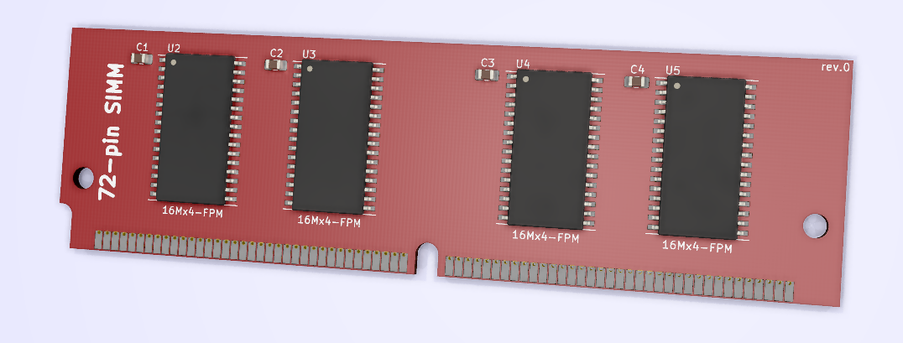

# 72-pin SIMM KiCAD Template
A board outline and pad connections for 72-pin SIMM memory.

## Info
This is a blank template for making your own 72-pin SIMM memory in KiCAD. It is based off of the Samsung DRAM Module KMM53216000CK/CKG datasheet which I have included in this repository. 
\
\
Open hardware, feel free to do what you want with it.
